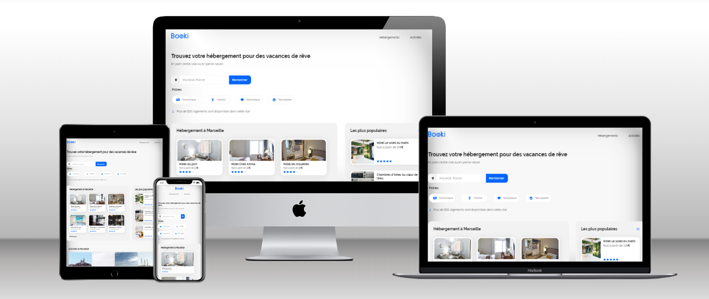

# Projet Developpeur - WordPress - OpenClassrooms

### Here's a link to  
<a href="https://raquel-salamone.fr/laboratoire/booki/" target="_blank" alt=Booki style="margin-top: 10px;"> Booki</a>
 
<a href="https://www.figma.com/file/B3eLowtWREc9YXzBcGRAHn/Maquettes-Booki-(desktop)?type=design&node-id=3-0&mode=design&t=z0UFacK3rZT97T0a-0" target="_blank" alt= Maquette Booki style="margin-top: 10px;"> Maquette Design</a>
 

---

### Projet 3 - Booki  
L’entreprise souhaite développer un site Internet qui permette aux usagers de trouver des hébergements et des activités dans la ville de leur choix.

### Obectif : 
Vous êtes chargé d'intégrer l'interface du site avec du code HTML et CSS. Pour cela, vous travaillez en étroite collaboration avec Sarah, la CTO, et Loïc, l’UI designer. 
 

---

